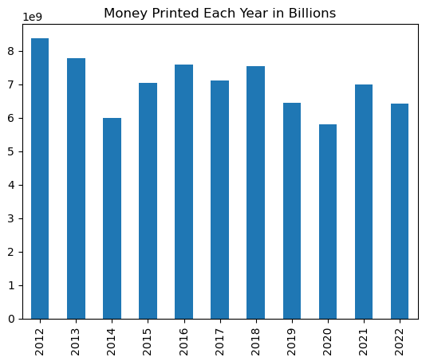

# Class_Project_Group_5

- Class project for group 5 team members, Michael Sheridan, Terry Hood, and Matthew Watkins.

## Module 9 Project 1

- The team will work as a group to find and analyze a dataset of choice and work in the team repository created in Github
  https://github.com/MWatkins87/Class_Project_Group_5
- @MWatkins87's Group 5 Group Project has been created as a Kanban project in Github's Project section
  https://github.com/users/MWatkins87/projects/2/views/1

- Project 1 Overview and list of requirements can be found in the DU Bootcampspot.com website
  https://bootcampspot.instructure.com/courses/5432/pages/9-project-1-overview?module_item_id=1200592

### Executive Summary

---

**Introduction to the Analysis of Real Estate Price Trends**

The recent surge in housing prices in the American real estate landscape presents a significant challenge, with conventional wisdom attributing it primarily to internal migration and a stagnant housing supply. However, contrary to expectations, regions experiencing population declines have not seen corresponding decreases in housing prices, suggesting additional influencing factors.

This study investigates alternative factors affecting housing price trends across ten selected cities, representing both booming and sluggish markets. These cities include Atlanta, Miami, Detroit, Tampa, and Las Vegas with strong market growth, and Baltimore, New Orleans, Washington D.C., San Francisco, and Portland with less robust markets.

Analysis spanning from 2012 to 2022 incorporates various variables such as population growth, homelessness, crime rates, college tuition costs, and mortgage rates to identify correlations explaining the divergent housing price trends observed.

### Project Approach

---

Our project began with an intensive brainstorming session, wherein we delineated the project's objectives, delineated goals, and pinpointed key variables and social contexts likely to yield impactful datasets for comparison against our foundational dataset of median housing prices.

Slack communication Direct Message channel, Slack Huddle, Google Meets, Zoom, were all identified as team communication methodologies.

Task allocation was developed and populated in a Kanban style Project in GitHub Project, with team members assigned specific elements to navigate through the project's trajectory. Throughout the project lifecycle, we engaged in continuous comparison of dataset discoveries, collaborated to resolve coding intricacies, and conducted thorough reviews and evaluations of each other's work as part of a rigorous quality assurance process.

Collaboratively, we delved into the analysis of our findings, endeavoring to discern their implications and uncover correlations of significance.

### Dataset Overview - Data Collection, Cleanup, and Exploration Processes

---

##### _Project Dataset Zillow -"house_values_zillow.csv" to Establish Housing Price Baseline_

1.  First step is to pull data from Zillow and import the data from .csv file

    ```python
    house_values_df = pd.read_csv("house_values_zillow.csv")
    ```

2.  We then set variable values for "hv_filtered, States, Cities, Metro, Years"
3.  New Filtered DataFrames were created for the "States, Cities, Metro" data
4.  Metro data required filling and rounding the data to make it easier to read (.fillna, round)
5.  Column rename, for loop, and resetting the index to the renamed "years" column organized our filtered DataFrame

    ```python
    # reading in the hopuse values dataset
    house_values_df = pd.read_csv("house_values_zillow.csv")

    # filtering down to just the columns we need to run the analysis on
    hv_filtered = house_values_df[["RegionName", "StateName", "Metro","2012-01-31","2013-01-31","2014-01-31","2015-01-31","2016-01-31","2017-01-31","2018-01-31","2019-01-31","2020-01-31","2021-01-31","2022-01-31"]] #only the columns I want

    # this was the original location of the states list. it was moved higher to be used by the other filters
    states = ["GA","CA", "DC", "MI", "FL", "LA", "MD", "OR", "NV"]

    # creating a list of cities we will do our research on
    cities=["Atlanta","Detroit", "Tampa", "Las Vegas", "Miami", "New Orleans", "Washington", "Baltimore", "Portland", "San Francisco"]

    # a list to filter down to just the metro areas we were interested in
    metro = ["Las Vegas-Henderson-Paradise, NV", "San Francisco-Oakland-Berkeley, CA", "Miami-Fort Lauderdale-Pompano Beach, FL", "Portland-Vancouver-Hillsboro, OR-WA", "Washington-Arlington-Alexandria, DC-VA-MD-WV", "Detroit-Warren-Dearborn, MI", "Baltimore-Columbia-Towson, MD", "Atlanta-Sandy Springs-Alpharetta, GA", "Tampa-St. Petersburg-Clearwater, FL", "New Orleans-Metairie, LA"]

    # a list to jst give us the years we are interested in researching
    years = np.arange(2012,2022,1)

    # applying our states filter
    filtered_states_df = hv_filtered[hv_filtered.isin(states).any(axis=1)]

    # applying our cities filter
    filtered_cities_df = filtered_states_df[filtered_states_df.isin(cities).any(axis=1)]

    # applying our metro areas filter
    filtered_metro_df = filtered_cities_df[filtered_cities_df.isin(metro).any(axis=1)]

    # filling any na values with 0 so they wouldnt throw off the data filtering
    filtered_metro_df['2012-01-31'] = filtered_metro_df['2012-01-31'].fillna(0)
    filtered_metro_df['2013-01-31'] = filtered_metro_df['2013-01-31'].fillna(0)
    filtered_metro_df['2014-01-31'] = filtered_metro_df['2014-01-31'].fillna(0)
    filtered_metro_df['2015-01-31'] = filtered_metro_df['2015-01-31'].fillna(0)
    filtered_metro_df['2016-01-31'] = filtered_metro_df['2016-01-31'].fillna(0)
    filtered_metro_df['2017-01-31'] = filtered_metro_df['2017-01-31'].fillna(0)
    filtered_metro_df['2018-01-31'] = filtered_metro_df['2018-01-31'].fillna(0)
    filtered_metro_df['2019-01-31'] = filtered_metro_df['2019-01-31'].fillna(0)
    filtered_metro_df['2020-01-31'] = filtered_metro_df['2020-01-31'].fillna(0)
    filtered_metro_df['2021-01-31'] = filtered_metro_df['2021-01-31'].fillna(0)
    filtered_metro_df['2022-01-31'] = filtered_metro_df['2022-01-31'].fillna(0)

    # Rounding each value so they are easier to read
    filtered_metro_df['2012-01-31'] = round(filtered_metro_df['2012-01-31'], 2)
    filtered_metro_df['2013-01-31'] = round(filtered_metro_df['2013-01-31'], 2)
    filtered_metro_df['2014-01-31'] = round(filtered_metro_df['2014-01-31'], 2)
    filtered_metro_df['2015-01-31'] = round(filtered_metro_df['2015-01-31'], 2)
    filtered_metro_df['2016-01-31'] = round(filtered_metro_df['2016-01-31'], 2)
    filtered_metro_df['2017-01-31'] = round(filtered_metro_df['2017-01-31'], 2)
    filtered_metro_df['2018-01-31'] = round(filtered_metro_df['2018-01-31'], 2)
    filtered_metro_df['2019-01-31'] = round(filtered_metro_df['2019-01-31'], 2)
    filtered_metro_df['2020-01-31'] = round(filtered_metro_df['2020-01-31'], 2)
    filtered_metro_df['2021-01-31'] = round(filtered_metro_df['2021-01-31'], 2)
    filtered_metro_df['2022-01-31'] = round(filtered_metro_df['2022-01-31'], 2)

    # renaming the first column to year for the graphs below
    filtered_metro_df = filtered_metro_df.rename(columns={"RegionName":"Year"})

    # and easier way to rename the columns in a for loop so i don't have to write it out 10 times
    for i in range(2012,2023):
       filtered_metro_df = filtered_metro_df.rename(columns={f"{i}-01-31":f"{i}"})

    # setting the index to the renamed Year column
    real_estate_prices = filtered_metro_df.set_index("Year")
    real_estate_prices.head(20)
    ```

6.  Column(s) drop, Transpose, and conversion to DataFrame to prepare for plotting(.drop, .transpose, pd.DataFrame)

    ```python
    # dropping the columns we dont need anymore
    real_estate_prices = real_estate_prices.drop(real_estate_prices.columns[0:2], axis=1)

    # using the Transpose command to swap the rows and columns
    real_estate_prices = real_estate_prices.transpose()

    # converting to a dataframe
    real_estate_prices_plot = pd.DataFrame(real_estate_prices)
    ```

7.  Further DF cleanup with iloc to remove additional reference to 2nd Washington City column and for loop with .plot command to plot the median home prices n the target cities.

    ```python
    # drops extra washington from "Washington Michigan" from the DataFrame
    real_estate_prices_plot = real_estate_prices_plot.iloc[:, :-1]

    # this for loop loops through each city and plots a graph for it showing the increase to home values over 10 years
    for city in cities:
       current_city = real_estate_prices_plot[[city]].plot(kind="bar", title=city, legend=False)
       plt.ylabel("House Values (US Dollars)")
       plt.show()
    ```

8.  Plot output results for median house prices in the 10 target cities

#### _mathew_watkins.ipynb_

##### _Dataset collected for Average College Tuition Costs_

`Note: Zillow baseline dataset was utilized for beginning analysis framework.`

1. First step is to pull data from US Dept of Education and import the data from .csv file

   ```python
   college_data21_22 = pd.read_csv("../Resources/data/MERGED2021_22_PP.csv", low_memory=False)
   ```

2. We then a new DataFrame and created our Column selection for the ne DF
3. New Filtered DataFrames were created for the "States, Cities" data
4. The DF was further flattened removing un-needed columns
5. The DF was grouped by city and the mean was calculated for each city average tuition cost(.groupby, .mean())
6. Column renamed for clarity and further sorting (.rename)

   ```python
   # reading in the csv for the school year
   college_data21_22 = pd.read_csv("../Resources/data/MERGED2021_22_PP.csv", low_memory=False)

   # only the columns I want for average college tuition prices
   college21_22 = college_data21_22[["INSTNM","CITY","STABBR","COSTT4_A"]]

   # filtering by state first to avoid running into issues with having the same city name in different states
   cf_22_df = college21_22[college21_22.isin(states).any(axis=1)]

   # filtering by the cities
   cf_22_df = college21_22[college21_22.isin(cities).any(axis=1)]

   # removing columns i don't need anymore
   no_instnm_df = cf_22_df[["CITY","COSTT4_A"]]

   # so i can have the same metric to measure change and not individual tuition prices I mean()ed the costs for each city
   by_city_22 = no_instnm_df.groupby(["CITY"]).mean()

   # because i want this to be time series i've renamed the avg tuition cost column to year
   by_city_22 = by_city_22.rename(columns={"COSTT4_A":"2022"})
   by_city_22.head(20)
   ```

7. Now that we have a data set for each year I concatenated them together into one DataFrame

   ```python
   merged_college_cost = pd.concat([by_city_13, by_city_14, by_city_15, by_city_16, by_city_17, by_city_18, by_city_19, by_city_20, by_city_21, by_city_22], axis="columns", join="inner")
   ```

8. The DF was transposed to prepare for plotting (.transpose())

   ```python
   merged_college_cost = merged_college_cost.transpose()
   ```

9. This for loop goes through each city in the cities list we made earlier and plots a bar graph so we can see the change over 10 years

   ```python
   for city in cities:
     current_college_city = merged_college_cost[[city]].plot(kind="bar", title=city, legend=False, ylabel='Average Tuition Cost')
   plt.show()
   ```

##### _Scholastic Aptitude Dataset_

`Note: Zillow baseline dataset was utilized for beginning analysis framework.`

1. First step is to pull data from US Dept of Education and import the data from .csv file

   ```python
   sat_data21_22 = pd.read_csv("../Resources/data/MERGED2021_22_PP.csv", low_memory=False)
   ```

2. We then a new DataFrame and created our Column selection for the ne DF
3. New Filtered DataFrames were created for the "States, Cities" data
4. The DF was further flattened pulling only "CITY","SAT_AVG" columns
5. The DF was further refined with .dropna to clear out NaN's
6. The DF was grouped by city and the mean was calculated for each city average SAT score(.groupby, .mean())
7. Column renamed for clarity and further sorting (.rename)

   ```python
   #only the columns I want for sat averages
   sat_data20_21 = sat_data20_21[["INSTNM","CITY","STABBR", "SAT_AVG"]]

   # filter out the states
   sat_data20_21 = sat_data20_21[sat_data20_21.isin(states).any(axis=1)]

   # filter out the cities
   sat_data20_21 = sat_data20_21[sat_data20_21.isin(cities).any(axis=1)]

   # take just the city and sat averages
   sat_data20_21 = sat_data20_21[["CITY","SAT_AVG"]]

   # drop the columns with "NaN"
   sat_data20_21.dropna(how='any')

   # sort by city and take the average SAT score for that city
   sat_data20_21 = sat_data20_21.groupby(["CITY"]).mean()

   # rename the average score column to the year
   sat_data20_21 = sat_data20_21.rename(columns={"SAT_AVG":"2021"})
   display(sat_data20_21)
   ```

8. Now that we have a data set for each year I concatenated them together into one DataFrame

   ```python
   merged_avg_sat = pd.concat([sat_data12_13, sat_data13_14, sat_data14_15, sat_data15_16, sat_data16_17, sat_data17_18, sat_data18_19, sat_data19_20, sat_data20_21, sat_data21_22], axis="columns", join="inner")
   ```

9. The DF was transposed to prepare for plotting (.transpose())

   ```python
   merged_avg_sat = merged_avg_sat.transpose()
   ```

10. This for loop goes through each city in the cities list we made earlier and plots a bar graph so we can see the change over 10 years

    ```python
    for city in cities:
      current_sat_college_city = merged_avg_sat[[city]].plot(kind="bar", title=city, legend=False, ylabel='Average SAT Scores')
    plt.show()
    ```

##### _Bureau of Engraving and Printing Dataset_

`Note: Zillow baseline dataset was utilized for beginning analysis framework.`

1. First step is to pull data from Bureau of Engraving and Printing by reading the data directly from the URL.

   ```python
   url = 'https://www.bep.gov/currency/production-figures/annual-production-reports'
   money = pd.read_html(url)
   money
   ```

2. The dataset was then used to define DataFrames to be merged, and cleaned

   ```python
   combined_df = money[0]
     for df in money[1:3]:
         combined_df = pd.merge(combined_df, df, on='Denomination', how='inner')
     money_df = combined_df[["FY 2012", "FY 2013", "FY 2014", "FY 2015", "FY 2016", "FY 2017", "FY 2018", "FY 2019", "FY 2020", "FY 2021", "FY 2022"]]
     for i in range(2010,2024):
         money_df = money_df.rename(columns={f"FY {i}":f"{i}"})
     money_df
   ```

3. The columns were then filtered for sum and the DF was prepared for plotting values

   ```python
   printed_money_totals_df = money_df.sum()
   printed_money_totals_df.plot(kind='bar', title='Money Printed Each Year in Billions')
   ```

   

#### _michael_sheridan.ipynb_

##### _Data.Gov for Crime dataset_

`Note: Zillow baseline dataset was utilized for beginning analysis framework. Michael used a scalar technique to compare disparate metrics`

```python
#Scales the real estate pricing into z-scores in order to accurately compare disparate metrics
scaler = StandardScaler()
scaled_real_estate_prices = scaler.fit_transform(real_estate_prices)
scaled_real_estate_prices_df = scaled_df = pd.DataFrame(scaled_real_estate_prices, columns=real_estate_prices.columns)
```

1. Pull in data from .csv to create initial DataFrame

   ```python
   #read in crime data and create data frame

   crime_by_city_data = pd.read_csv("us_crime_data_by_city - Sheet1.csv")
   ```

2. Data cleanup - Column selection and renaming for readability

3. Scale the data for z-score compatibility with the Real Estate DataFrame

   ```python
   #scales the crime data into z-score in order accurately compare with real estate prices
   scaler = StandardScaler()
   scaled_crime_data = scaler.fit_transform(crime_data)
   scaled_crime_data_df = scaled_df = pd.DataFrame(scaled_crime_data, columns=crime_data.columns)
   ```

4. Data cleanup / preparation - Concat, formatting and re-ordering columns

   ```python
   scaled_real_estate_prices_df.reset_index(drop=True, inplace=True)
   scaled_crime_data_df.reset_index(drop=True, inplace=True)
   crime_vs_real_estate = pd.concat([scaled_real_estate_prices_df, scaled_crime_data_df], axis=1, join='inner')
   #adding the year column back in
   years = list(range(2012,2023))
   crime_vs_real_estate['Year'] = years
   #reordering columns to make years first
   crime_vs_real_estate = crime_vs_real_estate[['Year', 'Las Vegas', 'San Francisco', 'Miami', 'Portland', 'Washington', 'Detroit', 'Baltimore', 'Atlanta', 'Tampa', 'New Orleans', 'Las Vegas Crime', 'San Francisco Crime', 'Miami Crime', 'Portland Crime', 'Washington Crime','Detroit Crime', 'Baltimore Crime', 'Atlanta Crime', 'Tampa Crime', 'New Orleans Crime']]
   crime_vs_real_estate.set_index('Year', inplace=True)
   crime_vs_real_estate
   ```

5. Further data prep was required to remove cities that did not report data in 2021

   ```python
   #As 40% of US cities did not report data in 2021 including four in our dataset the year was removed from analysis
   crime_vs_real_estate = crime_vs_real_estate[~crime_vs_real_estate.index.isin([2021])]
   ```

6. Data Exploration pre-format - Analysis using Pearson Correlation Matrix

   ```python
   #Creates a matrix of Pearson Coefficients to determine correlation
   pearson_correlation_matrix = crime_vs_real_estate.corr()
   pearson_correlation_matrix
   ```

7. Create plot code to explore Pearson Coefficients and Crime Data Z-Scores data

   ```python
   #Extract the Pearson Coefficient for each city for the real estate prices and populations changes from 2012-2024
   city_pop_list= ['Las Vegas Crime', 'San Francisco Crime', 'Miami Crime', 'Portland Crime', 'Washington Crime','Detroit Crime', 'Baltimore Crime', 'Atlanta Crime', 'Tampa Crime', 'New Orleans Crime']

   x = []
   y = []
   for i, city in enumerate(cities):
      x.append(city)
      y.append(pearson_correlation_matrix.loc[city, city_pop_list[i]])

      print(i, city, pearson_correlation_matrix.loc[city, city_pop_list[i]])

   #create a graph for each city with the year, real estate price and homeless population
   plt.scatter(x,y, color='blue', marker='o')

   #format the plot

   plt.title(f'Pearson Correaltion Real Estate and Crime 2012-2022')
   plt.xlabel('City')
   plt.ylabel('Pearson Coefficient')
   plt.legend()
   plt.xticks(rotation=45)
   #saving the plot
   plt.savefig('real_estate_vs_crime.png', dpi=300, format='png', bbox_inches='tight')
   plt.show()
   ```

8. Create line graph's for each city to review

   ```python
   #create line graph for each city
   for x, city in enumerate(cities):

      #create a graph for each city with the year, real estate price and crime number
      plt.plot(crime_vs_real_estate.index, crime_vs_real_estate[city], label = "Real Estate Prices")
      plt.plot(crime_vs_real_estate.index, crime_vs_real_estate[city_pop_list[x]], label = "Crime Rate")

      #format the plot

      plt.title(f'{city} Real Estate and Crime')
      plt.xlabel('Year')
      plt.ylabel('Crime Rate (z-score)')
      plt.legend()
      plt.savefig(f'{city}_crime_vs_real_estate', dpi=300, format='png', bbox_inches='tight')
      plt.show()
   ```

##### _Population Growth Dataset_

`Note: Zillow baseline dataset was utilized for beginning analysis framework. Michael used a scalar technique to compare disparate metrics`

1. Create a DataFrame corelate Population data with the Real Estate dataset

   ```python
   #create data frame to correlate population changes to real estate prices
   population_data = crime_by_city_data[['Year', 'Las Vegas Pop', 'San Fran Pop', 'Miami Pop', 'Portland Pop', 'Wash Pop', 'Detroit Pop', 'Balt Pop', 'Atlanta Pop', 'Tampa Pop', 'New Orleans Pop']]
   population_data
   ```

2. Data Standardization and scaling - using StandardScaler

   ```python
   #Scales population data to z-scores to accurately compare population changes to real estate prices
   scaler = StandardScaler()
   scaled_population_data = scaler.fit_transform(population_data)
   scaled_population_data_df = scaled_df = pd.DataFrame(scaled_population_data, columns=population_data.columns)
   ```

3. Formatting the data with .concat, column adds, reset_index, set_index

   ```python
   #concat the population data to the real estate data
   scaled_real_estate_prices_df.reset_index(drop=True, inplace=True)
   scaled_population_data_df.reset_index(drop=True, inplace=True)
   population_vs_real_estate = pd.concat([scaled_real_estate_prices_df, scaled_population_data_df], axis=1, join='inner')
   #adding the year column back in
   years = list(range(2012,2023))
   population_vs_real_estate['Year'] = years
   #reordering columns to make years first
   population_vs_real_estate = population_vs_real_estate[['Year', 'Las Vegas', 'San Francisco', 'Miami', 'Portland', 'Washington', 'Detroit', 'Baltimore', 'Atlanta', 'Tampa', 'New Orleans', 'Las Vegas Pop', 'San Fran Pop', 'Miami Pop', 'Portland Pop', 'Wash Pop','Detroit Pop', 'Balt Pop', 'Atlanta Pop', 'Tampa Pop', 'New Orleans Pop']]
   population_vs_real_estate.set_index('Year', inplace=True)
   population_vs_real_estate
   ```

4. Create Pearson matrix and prepare for correlation between datasets

   ```python
   #Creates a Pearson matrix to calculate correlation between population changes and real estate prices
   pearson_pop_correlation_matrix = population_vs_real_estate.corr()
   pearson_pop_correlation_matrix
   ```

5. Data Exploration - extracting the Pearson Coefficient for each city for the Real Estate prices and Populations changes

   ```python
   #Extract the Pearson Coefficient for each city for the real estate prices and populations changes from 2012-2024
   city_pop_list= ['Las Vegas Pop', 'San Fran Pop', 'Miami Pop', 'Portland Pop', 'Wash Pop','Detroit Pop', 'Balt Pop', 'Atlanta Pop', 'Tampa Pop', 'New Orleans Pop']

   x = []
   y = []
   for i, city in enumerate(cities):
      x.append(city)
      y.append(pearson_pop_correlation_matrix.loc[city, city_pop_list[i]])

      print(i, city, pearson_pop_correlation_matrix.loc[city, city_pop_list[i]])

   #create a graph for each city with the year, real estate price and homeless population
   plt.scatter(x,y, color='blue', marker='o')

   #format the plot

   plt.title(f'Pearson Correaltion Real Estate and Population Change 2012-2022')
   plt.xlabel('City')
   plt.ylabel('Pearson Coefficient')
   plt.xticks(rotation=45)
   plt.legend()
   plt.savefig('pearson_pop_vs_real_estate', dpi=300, format='png', bbox_inches='tight')
   plt.show()
   ```

6. Plotting data for each city for analysis with for loop

   ```python
   for x, city in enumerate(cities):

    #create a graph for each city with the year, real estate price and crime number
    plt.plot(population_vs_real_estate.index, population_vs_real_estate[city], label = "Real Estate Prices")
    plt.plot(population_vs_real_estate.index, population_vs_real_estate[city_pop_list[x]], label = "Population")

    #format the plot

    plt.title(f'{city} Real Estate and Population')
    plt.xlabel('Year')
    plt.ylabel('Population (z-score)')
    plt.legend()
    plt.savefig(f'{city}_pop_vs_real_estate')
    plt.show()
   ```

##### _Homelessness Dataset_

`Note: Zillow baseline dataset was utilized for beginning analysis framework. Michael used a scalar technique to compare disparate metrics`

1. This dataset had some years od data missing, so initially we created a dataset for the years available

   ```python
   #Creates a list of years that HUD homeless data is available
   years = [2012, 2013, 2014, 2015, 2016, 2017, 2019, 2021,2022]
   #Creates a list of CoCs that correspond respond to the cities in the study
   coc_name = ["San Francisco CoC", "Tampa/Hillsborough County CoC", "Miami-Dade County CoC", "Atlanta CoC","New Orleans/Jefferson Parish CoC", "Baltimore County CoC", "Detroit CoC", "Portland, Gresham/Multnomah County CoC", "Las Vegas/Clark County CoC", "District of Columbia CoC"]
   #Initializes a list in order place the homeless data for each city per year
   filtered_dataframes =[]
   for year in years:
      path = "./Michaels_CSVs/" + str(year) + ".csv"
      try:
         year_df =pd.read_csv(path)
         filtered_df = year_df[year_df['CoC Name'].isin(coc_name)].copy()
         filtered_df[f'Year'] = year
         filtered_dataframes.append(filtered_df)
      except Exception as e:
         print(f"Failed to process {path}: {e}")
   #Creates a data frame from the filtered homeless data
   homeless_data_df=pd.concat(filtered_dataframes)
   ```

2. Data cleanup to filter, remove comma's, pivot and rename columns to cleanup the dataset

   ```python
   #Filters the relevant columns of year, city and homeless count
   homeless_by_year = homeless_data_df[['Year', 'CoC Name', 'Overall Homeless']]
   #Removes the comma from the homeless number in order to create into an integer
   homeless_by_year['Overall Homeless'] = homeless_by_year['Overall Homeless'].str.replace(',','').astype(int)
   #Creates a pivot table to index by year and use the values in the CoC columns to create new columns then use corresponding data as the data frame values
   homeless = homeless_by_year.pivot_table(index='Year', columns='CoC Name', values='Overall Homeless')
   #Renames the columns by city
   homeless = homeless.rename(columns={'CoC Name' : 'Year', 'Atlanta CoC' : 'Atlanta Homeless', 'Baltimore County CoC' : 'Baltimore Homeless', 'Detroit CoC' : 'Detroit Homeless', 'District of Columbia CoC' : 'Washington Homeless', 'Las Vegas/Clark County CoC' : 'Las Vegas Homeless', 'Miami-Dade County CoC' : 'Miami Homeless', 'New Orleans/Jefferson Parish CoC' : 'New Orleans Homeless', 'Portland, Gresham/Multnomah County CoC' : 'Portland Homeless', 'San Francisco CoC' : 'San Francisco Homeless', 'Tampa/Hillsborough County CoC' : 'Tampa Homeless'})

   homeless
   ```

3. Further data refinement to adjust homeless numbers to percentage of population

   ```python
   #Adjusting homeless numbers to percentage of population
   #population_data = population_data[~population_data.index.isin([6,8])]
   population_data.set_index('Year', inplace=True)

   homeless_pop_df = pd.concat([homeless, population_data], axis=1, join='inner')
   homeless_pop_df.rename(columns={'Wash Pop' : 'Washington Pop',
                                 'San Fran Pop' : 'San Francisco Pop',
                                 'Balt Pop' : 'Baltimore Pop'}, inplace=True)

   for city in cities:
      homeless_col = f'{city} Homeless'
      population_col =f'{city} Pop'
      for year in years:
         homeless_rate= homeless_pop_df.loc[year,homeless_col] / homeless_pop_df.loc[year, population_col]
         homeless_pop_df.loc[year, homeless_col] = homeless_rate

   homeless = homeless_pop_df
   ```

4. Scale the data into z-scores to prepare data to correlate with the Real Estate DataFrame

   ```python
   #scales the homeless data into z scores in order to correlate with real estate prices
   scaler = StandardScaler()
   scaled_homeless = scaler.fit_transform(homeless)
   scaled_homeless_df = scaled_df = pd.DataFrame(scaled_homeless, columns=homeless.columns)
   ```

5. Remove year columns in the Real Estate DF to match the homeless DF to prepare for correlation

   ```python
   #remove the two missing years from the real estate data frame to match that of the homeless data frame
   scaled_real_estate_prices_df = scaled_real_estate_prices_df[~scaled_real_estate_prices_df.index.isin([6,8])]
   scaled_real_estate_prices_df
   ```

6. Reset the Real Estate DF index to prepare DF

   ```python
   #Resets the index to a continuous list of numbers
   scaled_real_estate_prices_df.reset_index(inplace=True)
   ```

7. Further DF prep by combining the homeless and Real Estate DF's with .concat, adding missing years back in to combined DF, and re-ordering columns

   ```python
   #concat the homeless data to the real estate data
   homeless_vs_real_estate = pd.concat([scaled_real_estate_prices_df, scaled_homeless_df], axis=1, join='inner')
   #adding the year column back in
   homeless_vs_real_estate['Year'] = years
   #reordering columns to make years first
   homeless_vs_real_estate = homeless_vs_real_estate[['Year', 'Las Vegas', 'San Francisco', 'Miami', 'Portland', 'Washington', 'Detroit', 'Baltimore', 'Atlanta', 'Tampa', 'New Orleans', 'Las Vegas Homeless', 'San Francisco Homeless', 'Miami Homeless', 'Portland Homeless', 'Washington Homeless','Detroit Homeless', 'Baltimore Homeless', 'Atlanta Homeless', 'Tampa Homeless', 'New Orleans Homeless']]
   homeless_vs_real_estate.set_index('Year', inplace=True)
   homeless_vs_real_estate
   ```

8. Create a matrix for the Pearson oefficients correlating homeless populations and real estate prices

   ```python
   #Creates a matrix of Pearson Coefficients correlating homeless populations and real estate prices
   pearson_homeless_correlation_matrix = homeless_vs_real_estate.corr()
   pearson_homeless_correlation_matrix
   ```

9. Data Exploration - Creating the plotting data outputs by extracting the Pearson Coefficient for each city, create the graph and formatting plot attributes

   ```python
   #Extract the Pearson Coefficient for each city for the real estate prices and homeless populations from 2012-2024
   city_homeless_list= ['Las Vegas Homeless', 'San Francisco Homeless', 'Miami Homeless', 'Portland Homeless', 'Washington Homeless','Detroit Homeless', 'Baltimore Homeless', 'Atlanta Homeless', 'Tampa Homeless', 'New Orleans Homeless']

   x = []
   y = []
   for i, city in enumerate(cities):
      x.append(city)
      y.append(pearson_homeless_correlation_matrix.loc[city, city_homeless_list[i]])
      print(city, pearson_homeless_correlation_matrix.loc[city, city_homeless_list[i]])

   #create a graph for each city with the year, real estate price and homeless population
   plt.scatter(x,y, color='blue', marker='o')

   #format the plot

   plt.title(f'Pearson Correaltion Real Estate and Homeless Population 2012-2022')
   plt.xticks(rotation=45)
   plt.xlabel('City')
   plt.ylabel('Pearson Coefficient')
   plt.legend()
   plt.savefig('pearson_homeless_vs_real_estate', dpi=300, format='png', bbox_inches='tight')
   plt.show()
   ```

10. Data Exploration - Using a for loop to create a graph for each city with the year, real estate price and homeless population

```python
for x, city in enumerate(cities):

 #create a graph for each city with the year, real estate price and homeless population
 plt.plot(homeless_vs_real_estate.index, homeless_vs_real_estate[city], label = "Real Estate Prices")
 plt.plot(homeless_vs_real_estate.index, homeless_vs_real_estate[city_homeless_list[x]], label = "Homeless Population")

 #format the plot

 plt.title(f'{city} Real Estate and Homeless Population')
 plt.xlabel('Year')
 plt.ylabel('Homelessness (z-score)')
 plt.legend()
 plt.savefig(f'{city}_homeless_vs_real_estate')
 plt.show()
```

#### _terry_hood.ipynb_ - Not Utilized in this Study

### Dataset(s)

---

#### Zillow - Housing Price

- ([Zillow Housing Data](https://www.zillow.com/research/data/))
- CSV Data Name - house_values_zillow.csv
- ([Licensing for public records:](https://www.zillow.com/corp/PublicDataTerms.htm))

#### US Department of Education - Tuition and SAT

- ([DataSetURL](https://collegescorecard.ed.gov/data/))
- ([Licensing/Copyright](https://www2.ed.gov/notices/copyright/index.html))

#### Bureau of Engraving and Printing - Money Printing

- ([bep.gov](https://www.bep.gov/currency/production-figures/annual-production-reports))
- ([Licensing](https://www.bep.gov/footer/foia))

#### Data.gov - Home of US Government's Open Data - Crime and Population

- ([Data.Gov](https://data.gov/))
- ([Licensing](https://catalog.data.gov/dataset/uniform-crime-reporting-ucr-program))
- Dataset - us_crime_data_by_city - Sheet1.csv

#### US Department of Housing and Urban Development - Homelessness

- ([hud.gov](https://www.hud.gov/program_offices/comm_planning/coc/pit-count))
- ([Licensing](https://www.huduser.gov/portal/research/pdr_data-license.html#Data%20Available%20Through%20The%20Data%20License%20Agreement%20Process))

### Additional Research -

---

1. List additional questions that surfaced during analysis

- How much paper money is destroyed each year

2. Additional research identified if time was available

- The Most Valuable Housing Markets in America
- Housing market predictions: The forecast for the next 5 years
- Who is Buying a House in this Market?
- Rental income and its effect on housing prices

3. Future development or code architecture that would make continued analysis more streamlined and productive

- Future endeavors could expand the scope by encompassing a comprehensive analysis of all markets across the United States, offering a more extensive perspective on potential correlations.
- Moreover, our examination was restricted to only six potential influences on the market, overlooking crucial factors such as mortgage rates, short-term rentals, housing construction starts, and properties owned by investors. The absence of accessible data, particularly at the city level and within the time frame of our study, hindered the exploration of these additional variables.
- Additionally, recent developments in the market, such as the Federal Reserve's actions to temper the housing market by increasing interest rates, have introduced significant changes. It's essential to recognize that adjustments in market variables often exhibit a lag in influence. Thus, it remains pertinent to monitor the impact of recent occurrences, such as population declines in many urban centers, on the real estate market.

### Results and Conclusions

---

**Limits and Considerations**

Our study was constrained by several limitations stemming from the scope and timeframe of the project. Firstly, the number of markets analyzed was limited due to logistical constraints and the complexities of capturing diverse market influences within the project's deadline.

Future endeavors could expand the scope by encompassing a comprehensive analysis of all markets across the United States, offering a more extensive perspective on potential correlations.

Moreover, our examination was restricted to only six potential influences on the market, overlooking crucial factors such as mortgage rates, short-term rentals, housing construction starts, and properties owned by investors. The absence of accessible data, particularly at the city level and within the time frame of our study, hindered the exploration of these additional variables.

Additionally, recent developments in the market, such as the Federal Reserve's actions to temper the housing market by increasing interest rates, have introduced significant changes. It's essential to recognize that adjustments in market variables often exhibit a lag in influence. Thus, it remains pertinent to monitor the impact of recent occurrences, such as population declines in many urban centers, on the real estate market

**Conclusion**

_Real Estate Market Dynamics:_
Across all ten markets analyzed, real estate prices consistently increased each year. However, this growth was not uniform; the five underperforming markets experienced modest increases compared to the explosive growth observed in the top-performing markets. The lack of a control group makes it challenging to establish robust correlations or causations between observed trends and specific variables.

_Data Reliability Concerns:_
The study faced significant challenges with data reliability:

FBI Crime Data: This data is reported voluntarily by municipalities, which frequently fail to submit annual updates, compromising data completeness.
Homelessness Counts: Accurately collecting homelessness data proved difficult as it largely depends on NGOs to organize and report counts, which can vary widely in methodology and completeness.
Public Perception vs. Reality:
Our findings challenge several prevailing public perceptions regarding crime, homelessness, monetary expansion, and tuition increases. Contrary to popular narratives, these variables either declined or remained stable, suggesting that common assumptions about their trends may be unfounded.

_Influence of Inflation:_
The study period was marked by rapid inflation, complicating the analysis as the general increase in prices across the board made it difficult to isolate specific causes for changes in real estate prices. This inflationary context adds ambiguity to the results, as it is challenging to distinguish the effects of individual variables.

_Correlation Analysis:_
The study did not uncover any definitive correlations that could comprehensively explain the housing cost crisis. However, a significant finding was the strong positive correlation between housing prices and population growth, observed in six of the ten markets with Pearson Coefficients of 0.6 or greater. This suggests that housing price increases in these areas could largely be driven by supply and demand dynamics.

In the analysis, a conspicuous pattern emerges: a robust negative correlation between homelessness and housing prices. Among the ten markets scrutinized, three exhibited a modest negative correlation, while seven displayed a pronounced negative correlation. It's plausible that this correlation doesn't imply causation; rather, housing prices might be escalating due to distinct factors, while homelessness experiences a decline owing to unrelated causes.

_Summary of Results:_

Tuition Prices: Exhibited a weak positive correlation with housing prices.
SAT Scores: Also showed a weak positive correlation.
Monetary Expansion: No significant correlation was found.
Crime Rates: No significant correlation was observed.
Population Increase: Demonstrated a strong positive correlation, supporting a supply-demand explanation for housing price increases.
Homelessness: Strong negative correlation

_Overall Insights:_
The analysis underscores the complexity of the real estate market and points to population growth as a significant factor influencing housing prices. The absence of correlations with other variables like crime and homelessness highlights the need for a nuanced understanding of what truly drives housing markets. This study suggests that economic fundamentals such as population dynamics may have a more direct impact on housing prices than previously thought.

### Sources

---

- Python for Data Analysis - O'Reilly Books
- Class Lessons
- Instructor
- Teacher Assistant
- Classmates
- Xpert Learning Assistant
- GitHub Copilot
- Tabnine

* ([python](https://www.python.org/))
* ([pandas](https://pandas.pydata.org/))
* ([ChatGPT 3.5](https://chat.openai.com/))
* ([COPILOT](https://copilot.microsoft.com/))

```

```
